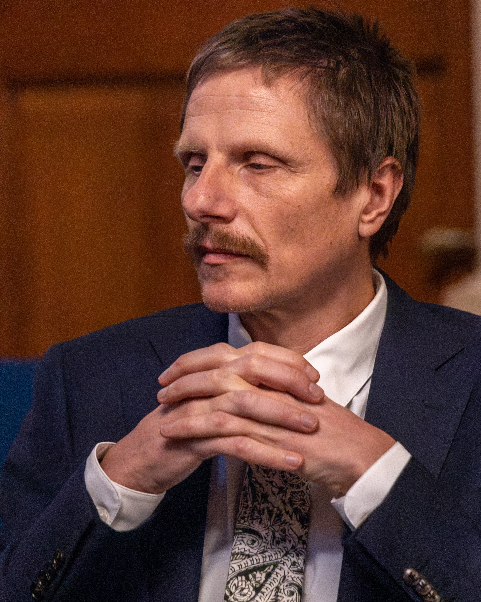

# Grzegorz Chrupała

/ˈɡʐɛɡɔʂ xru'pawa/ 
<audio controls src="name.wav">Your browser does not support the HTML5 Audio element.</audio>

I am an Associate Professor affiliated with the Center for Cognitive
Science and Artificial Intelligence at Tilburg University, where I lead
the [Computational Linguistics and Psycholinguistics](https://tcsai.github.io/language-computation/)
research unit.

I received my PhD from the School of Computing at Dublin City
University. After that I worked as a postdoctoral researcher at the
Spoken Language Systems group at Saarland University. I am interested
in computation in biological and artificial systems, and connections
between them.\\
See full [bio](#bio).

In my free time I like
[reading](https://www.goodreads.com/review/list/8777275-grzegorz-chrupa-a?shelf=read&sort=date_added),
taking [photos](https://photos.app.goo.gl/cDzGiN2tAC1S3csG9),
walking [[pl](https://pieszo.chrupala.me/#relacje){:hreflang="pl"}] [[en](https://onfoot.chrupala.me/#travel-reports){:hreflang="en"}]
and writing [[pl](https://pieszo.chrupala.me/#opowiadania){:hreflang="pl"}] [[en](https://onfoot.chrupala.me/#stories){:hreflang="en"}].

<h2 class="inline" id="research">Research</h2> by my team focuses on
computational approaches to multimodal communication. We take
inspiration from the ease which young children show for picking up
languages they are exposed to with little effort and no explicit
instruction. The information they rely on is messy and unstructured,
yet it is rich and multimodal, including speech and gestures, visual
and auditory stimuli, and interaction with other people. In contrast,
the typical way computers learn language is by reading billions of
words of written text.

We work on enabling machines to access rich data in multiple
modalities and find systematic connections between them as a way to
learn language in a more natural and data-efficient manner.

We explore the limits of human-like learning, aiming to teach
computers to deal not only with the world's largest languages, but
also with those with little written material, or no writing system at all.

We also develop, apply, and evaluate techniques for understanding
computations in deep learning architectures.

* toc
{:toc}

## News

- New preprint: [The rise and evolution of a referential code in populations of bee-like agents](https://arxiv.org/abs/2608.25779).
- Paper accepted to EMNLP 2026: [Beyond Decodability: Reconstructing Language Model Representations with an Encoding Probe](https://arxiv.org/abs/2605.00607) by Gaofei Shen, Martijn Bentum, Tom Lentz, Afra Alishahi and Grzegorz Chrupała.
- Paper accepted to LREC: [Mechanistic Interpretability Meets Cognitive Linguistics: Modelling Locative Image Schemas in the Circuit Framework](https://lrec.elra.info/lrec2026-main-885) by Mattia Proietti, Afra Alishahi, Grzegorz Chrupała and Alessandro Lenci.
- Gabriele Sarti, whose work I co-supervised with Arianna Bisazza and Malvina Nissim, defended his [PhD thesis](https://research.rug.nl/en/publications/from-insights-to-impact-actionable-interpretability-for-neural-ma/), and has thus become the first InDeep PhD.
- Paper accepted to TACL: [QE4PE: Word-level Quality Estimation for Human Post-Editing](https://doi.org/10.1162/TACL.a.46).
- We taught a [tutorial on Interpretability Techniques for Speech Models at Interspeech 2025](https://interpretingdl.github.io/speech-interpretability-tutorial/).
- Paper published at Interspeech 2025: [On the reliability of feature attribution methods for speech classification](https://www.isca-archive.org/interspeech_2025/shen25b_interspeech.html).
- Hosein presented [Posthoc Disentanglement of Textual and Acoustic Features in Self-Supervised Speech Encoders](https://actionable-interpretability.github.io/posters/poster_AIW2025%20-%20Hosein%20Mohebbi.pdf) at an ICML workshop on actionable interpretability.
- I have joined the board of the Dutch [Open Speech Technology Foundation](https://openspraaktechnologie.org/).
- I am publicity co-chair for Interspeech 2025.
- I am an action editor for TACL.

## People

- [Gaofei Shen](https://www.gaofeishen.com/). PhD candidate, Interpretability techniques for spoken language models.
- [Hosein Mohebbi](https://hmohebbi.github.io/). PhD candidate, Analyzing and interpreting deep neural models of language.
- [Lisa Lepp](https://research.tilburguniversity.edu/en/persons/lisa-lepp). PhD candidate, Machine Translation for sign and spoken languages.
- [Céline Angonin](https://research.tilburguniversity.edu/en/persons/c%C3%A9line-angonin). PhD candidate, bioacoustics.

### Alumni

- [Gabriele Sarti](https://gsarti.com/). PhD thesis: [From Insights to Impact: Actionable Interpretability for Neural Machine Translation](https://research.rug.nl/en/publications/from-insights-to-impact-actionable-interpretability-for-neural-ma/).
- [Chris Emmery](https://cmry.github.io/). PhD thesis: [User-Centered Security in Natural Language Processing](https://arxiv.org/abs/2301.04230).
- [Bertrand Higy](https://www.linkedin.com/in/bertrandhigy/?locale=en_US). Postdoc, Understanding visually grounded spoken language via multi-tasking.
- Patrick Bos and Christiaan Meijer. E-science engineers, Understanding visually grounded spoken language via multi-tasking.
- [Ákos Kádár](https://kadarakos.github.io/). PhD thesis: [Learning Visually Grounded and Multilingual Representations](https://kadarakos.github.io/assets/dissertation.pdf).

## Publications

For the complete list of publications check:
[Google Scholar](http://scholar.google.com/citations?user=p6m63xoAAAAJ&sortby=pubdate) |
[Semantic Scholar](https://www.semanticscholar.org/author/Grzegorz-Chrupala/2756960?q=&sort=influence&ae=false) |
[DBLP](https://dblp.org/pers/hd/c/Chrupala:Grzegorz) |
[ACL Anthology](https://www.aclweb.org/anthology/people/g/grzegorz-chrupala/) |
[ORCID](https://orcid.org/0000-0001-9498-6912)

### Selected papers

1. Shen, G., Watkins, M., Alishahi, A., Bisazza, A., Chrupała, G. (2024).
   Encoding of lexical tone in self-supervised models of spoken language.
   In Proceedings of the 2024 Conference of the North American Chapter of
   the Association for Computational Linguistics: Human Language
   Technologies (Volume 1: Long Papers) (pp. 4250-4261).\\
   [Paper](https://doi.org/10.18653/v1/2024.naacl-long.239) |
   [Code](https://github.com/techsword/tone-encoding-in-speech-model)

1. Nikolaus, M., Alishahi, A. & Chrupała, G. (2022). Learning English
   with Peppa Pig. *Transactions of the Association for Computational
   Linguistics*, 10, 922–936.\\
   [Paper](https://doi.org/10.1162/tacl_a_00498) |
   [Code](https://github.com/gchrupala/peppa/)

1. Chrupała, G. (2022). Visually grounded models of spoken language: A
   survey of datasets, architectures and evaluation techniques.
   *Journal of Artificial Intelligence Research,* 73, 673–707.\\
   [Paper](https://doi.org/10.1613/jair.1.12967)

1. Chrupała, G., & Alishahi, A. (2019). Correlating Neural and Symbolic
   Representations of Language. In Proceedings of the 57th Annual Meeting
   of the Association for Computational Linguistics (pp. 2952–2962).\\
   [Paper](https://doi.org/10.18653/v1/P19-1283) |
   [Code](https://github.com/gchrupala/correlating-neural-and-symbolic-representations-of-language)

1. Chrupała, G., Gelderloos, L., & Alishahi, A. (2017). Representations
   of language in a model of visually grounded speech signal. In
   Proceedings of the 55th Annual Meeting of the Association for
   Computational Linguistics (Volume 1: Long Papers) (pp. 613–622).\\
   [Paper](http://dx.doi.org/10.18653/v1/P17-1057) |
   [Code](https://github.com/gchrupala/visually-grounded-speech)

## Selected Talks

- Promises and pitfalls of unified NLP, NLG in the Lowlands, 2025
- Putting *natural* back into Natural Language Processing, Second Dutch Speech Tech Day, 2024
- Opening the black box of foundation models. Indeep Outreach/Amsterdam AI Meetup, 2023.
- TAISIG Talks - The opportunities and limitations of Deep Learning, Tilburg University, 2022.
- Learning language from Peppa Pig. ILLC seminar, University of Amsterdam, 2022.
- Visually Grounded Models of Spoken Language and their Analysis and Evaluation. Lectures on Computational Linguistics, AILC, 2021.

<!--
## Supervision

Selected MSc theses

- Jean Constantin. 2022. [Identification of causal discourse relations in French text using machine-translated training resources](https://tilburguniversity.on.worldcat.org/oclc/1371190842). Tilburg University.
- Kristel van Rooij. 2021. [Gender classification of first names using Long Short-Term Memory recurrent neural networks and support vector machine in various countries](https://tilburguniversity.on.worldcat.org/oclc/1319426781). Tilburg University.
- Aayushi Pandey. 2020. [Emotion recognition in a model of visually grounded speech](https://tilburguniversity.on.worldcat.org/oclc/1291689112). Tilburg University.
- Dmitrijs Surenans. 2020. [Machine Learning Explainability In Finance: An Application to Default Risk Analysis.](https://tilburguniversity.on.worldcat.org/oclc/1292464689) Tilburg University.
-->

## Bio

Grzegorz Chrupała is an Associate Professor at the Center for
Cognitive Science and Artificial Intelligence at Tilburg University,
where he leads the Computational Linguistics and Psycholinguistics
research unit. Previously he did postdoctoral research at the Spoken
Language Systems group at Saarland University. He received his
doctoral degree from the School of Computing at Dublin City
University.

He is interested in computation in biological and artificial systems,
and connections between them. His research focuses especially on
computational models of learning (spoken) language in naturalistic
multimodal settings, as well as analysis and interpretation of
representations emerging in deep learning architectures.

He is an Action Editor for TACL, and regularly serves as Senior Area
Chair for major NLP and AI conferences such as ACL and EMNLP. He was
one of the creators of the popular BlackboxNLP Workshop on Analyzing
and Interpreting Neural Networks for NLP. His research has been funded
by the Dutch Research Council (NWO).

## Contact

Grzegorz Chrupała\\
Center for Cognitive Science and Artificial Intelligence\\
Department of Intelligent Systems\\
Tilburg University\\
PO Box 90153\\
5000 LE Tilburg\\
The Netherlands

Bluesky: [@grzegorz.chrupala.me](https://bsky.app/profile/grzegorz.chrupala.me)\\
Web: [grzegorz.chrupala.me](https://grzegorz.chrupala.me)\\
Email: grzegorz@chrupala.me
